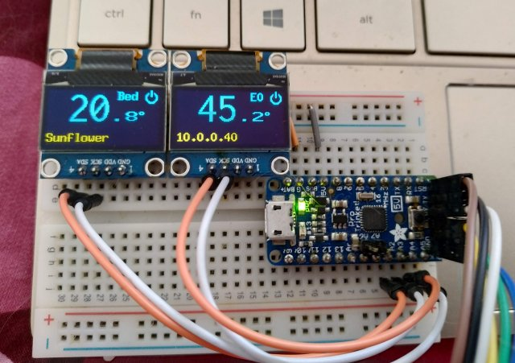

## Little Eyes For a printer..
# Temperature display for RepRap firmware (eg Duet)

* Only displays very basic info: Status, tool and bed activity + temperature, pct printed (when printing)
 * This is it.. the displays are less then an 2cm in size and I will not overload them with info
* Sends M408 requests for basic data and then proceses the Json reply
 * Uses the auxillary UART port on 32bit controllers (eg Duet)
* Also responds to some 'config' Json
 * timeout, update speed, brightness, and how to respect PSU control
* Sleep mode when controller reports status 'O' (PSU off, configurable)
* Activity LED that blinks on incoming data

## Requirements 
* ArduinoJSON (via IDE library manager or directly from <URL!!>

## Control
The ArduinoJSON library is used, which provides some robustness in processing key/value pairs (use of quotes etc; the Json must still be structually correct and terminated)
* {"printeye_interval":<integer>"}
 * Set the approximate interval in Ms that PrintEye spends waiting for a M408 response before retrying
* {"printeye_maxfail":i<integer>}
 * Maximum number of failures before displaying 'Waitinf for Printer"
 * '-1' to prevent entering 'Waiting for Printer' state
* {"printeye_brightness":<byte>}
 * Brightness for display, 0-255, 0 is off
 * The OLED's I use are very non-linear
* {"printeye_powersave":<boolean>}
 * If true enter sleep mode when printer status = 'O'
* {"printeye_allowpause":<boolean>}
 * If true allow the button to trigger a pause (M25) while printing, and resume (M24) when paused
* {"printeye_activityled":<byte>}
 * Brightness level (0-255) for the activity LED, set to 0 to disable
* {"printeye_idle_left":<string>} & {"printeye_idle_right":<string>}
 * Left and right panel text to be displayed in Idle mode, max 10 characters

## Caveats:
* S/W I2C is slow. Alternative (one HW + One SW) looks weird and unbalanced.
 * A I2C multiplexer would solve this, or using a chim (Mega256?) with dual hardware I2C
 * I have tried to compensate for the slow redrawing by sequencing the order of updating screen elements; eg making the updates look more like animations.
* The Json parser uses quite a bit of ram and cannot survive a sudden increase in size of M408 S0 responses (eg from a firmware update), currently they max out at 400 characters or so, and I allow a maximum of 450 bytes for Data +overhead.
* You will need level shifters for interfacing to a Duet UART (PanelDue) port if you run this at 16Mhz/5v, alternatively use a 12Mhz/3.3v combo, or experiment with the underclock option discussed in the setup() section of the sketch. Display updates will be even slower for this, and you might need to add a 3v3 regulator, or tap the controllers 3v3 line for power.

## Enhancements: 
* EEPROM for settings`    
* Pause button
* Active vs Standby; switch which is shown
* Heater Errors: Show, icon and put 'Error' in the status line.
* Find a lower memory footprint Json parser?
* Investigate wether it is possible to multiplex the HW I2C bus (SCK) with IO pins and a couple of signal diodes to address one display or the other, or both for setup, clearing etc.
