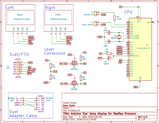
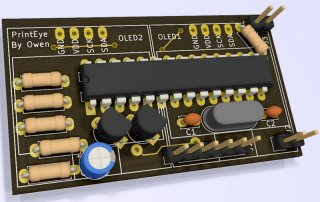

## Little Eyes For a printer..
# Temperature display for RepRap firmware (eg Duet)


* Only displays very basic info: Status, tool and bed status + temperatures, prcentage printed.
  * This is it.. the displays are less then an 2cm in size and I will not overload them with info.
* Periodically sends `M408 S0` status requests to the controller and processes the Json reply.
  * Uses Jsmn (jasmin) to process lots of Json in a smallish footprint.
* Also responds to some 'config' Json for update speed, brightness, button and [more](#control)
* Sleep mode when controller reports PSU off, (configurable).
* Activity LED and Pause/M112 button (configurable).
* User configurable status line in idle/busy modes
* Clearly shows when heaters are in a fault state.
* Plug-n-play with panelDue UART port.

# Hardware
## See: [PrintEyeHardware](https://github.com/easytarget/PrintEyeHardware).
The hardware for this is as important as the software; it runs on a standlaone ATmega328P on a custom PCB; this PCB has a FTDI connector for both programming and communicating to the target Duet controller.

 

* Level converters allow the PrintEye to run at 5V while communicating with the 3.3v Duet.
* This should also be Compatible with the (as of this writing) upcoming V3 Duet electronics
  * A new cable layout and duet config would be needed since the V3 hardware uses 5 pin connectors that can be mapped to functions

# Software
## Requirements 
* You need to include the [U8glib](https://github.com/olikraus/u8g2/) Graphics library for the displays; this is available in the ArduinoIDE; search for 'U8g2' in the library manager, or follow instructions [here](https://github.com/olikraus/u8g2/wiki) 
* The Jsmn library (https://github.com/zserge/jsmn) is included with the sketch.
* The Arduino MemoryFree lib was used during debug (see comments and `#define DEBUG` in code).
### Bootloader
Printeye is designed with the current 'Vanilla' Arduino Uno bootloader in mind; aka [Optiboot](https://github.com/Optiboot/optiboot), this is an excellent bootloader with a very small (512Byte) footprint.
It does work with the 2K bootloader in the Adafruit Pro Trinket I used for development, but free memory for program space is very low with this.
*
* To do the actual programming I used a FTDI adapter to do the programming and serial debugging during development; the circuit incorporates a the correct reset pin pullup+capacitor to allow low voltage in-circuit reprogramming.
  * For more on FTDI programmers see https://learn.adafruit.com/ftdi-friend/overview
  * I found I had to leave my FTDI programmer set to 5v for reliable programming of the final PCB; it would frequently fail to detect the reset pulldown otherwise.
  * I actually started with a vanilla (no bootloader) chip and had to first use [Nick Gammons Bootloader](http://www.gammon.com.au/bootloader) and my Arduino Uno to put optiboot on the vanilla chip and set the fuses initially.
### Bootloader part two; MiniCore.
I have subsequently found [MiniCore](https://github.com/MCUdude/MiniCore), which is one of a number of Optiboot implementations geared towards bare bones and breadboarded systems. It allows basic fuse choices such as CPU external frequency selection and brownout configuration to be set in tha Arduino IDE boards section easily. 
* Make sure to enable LTO (link time optimisation) in the settings too, this saves quite a lot of memory and ram.

## Development
I used the Arduino IDE for development and testing; and did a lot of work using the serial monitor to debug the printer operation after capturing a lot of typical `M408` responses at the start of the project ([see this](./tools/M408log.txt))

## Control
You can use `M118` from the terminal or in your macros to configure the PrintEye via Json.

* `{"pe_rate":integer}`
  * Set the approximate interval in ms that PrintEye spends waiting for a `M408` response before retrying
  * Default: 1000
* `{"pe_fails":integer}`
  * Maximum number of failures before displaying `Waiting for Printer`
  * `0` to prevent entering `Waiting for Printer` state
  * Default: 6
* `{"pe_bright":byte}`
  * Brightness for display, 0-255, 0 is off
  * Default 128
* `{"pe_saver":boolean}`
  * If true enter sleep mode when printer status = 'O' (Vin off)
  * Default: true
* `{"pe_bdelay":integer}`
  * Number of ms the button must be held to trigger
  * 0 will disable the Button completely
  * Default: 333
* `{"pe_bcfg":integer}`
  * Button Config / Action, as below.
    *  0 == No Action
    *  1 == Duet pause/resume in printing states, otherwise nothing.
    *  2 == Duet pause/resume in printing states, Octoprint pause/resume if Busy.
    * 11 == Duet pause/resume in printing states, M112 in Idle/Standby
    * 22 == Duet pause/resume in printing states, Octoprint pause/resume if Busy, M112 in Idle/Standby (default)
    * 33 == Duet pause/resume in printing states, M112 in all other states
    * 44 == Duet pause/resume in printing states, Octoprint pause/resume if Busy, M112 in all other states
    * 99 == Send Emergency stop M112 in all states
  * Octoprint pause is sent in Busy state, but the resume will be sent from Idle since Octoprint pausing leaves the printer in 'idle'.
  * LED will flash full power while button pressed and enabled, ignoring the brightness setting
* `{"pe_led":byte}`
  * Brightness level: (0-255) for the activity LED, set to 0 to disable
  * Default: 80
* `{"pe_imsg":"string"}`
  * IdleText, Twenty character maximum. 
  * The first ten character are the 'left' text, the next ten are 'right'.
  * Left and right panel text to be displayed in Idle and Sleep mode, max 10 characters, enclose in quotes.
  * Setting the left text to `SHOWSTATUS` results in the default behaviour of showing the actual status there

The Jsmn library provides some robustness in processing key/value pairs (in the use of quotes etc); but the Json must be structually correct and terminated.
* Be aware that you need to repeat double quotes to pass them via 'M118'.

### Octoprint
Needs expanding

### Examples; 
Disable sleep mode with `M118 P2 S"{""pe_saver"":false}"`

Use in macros like this:

```
; lights-dim.g
M42 P2 S0.1                  ; Heater2 (Led PWM) to 10%
M118 P2 S"{""pe_bright"":1}" ; Printeye as low as possible
```

## Caveats
* Memory is the biggest limit here; the Json parser uses quite a bit of ram, and code space. The Displays and their library eat the rest. I've had to fight low program memory and ram to get this working acceptably.
* Max json size = 500 bytes; or 86 [Jsmn tokens](https://github.com/zserge/jsmn#design).
  * Exceeding this causes the incoming Json to be ignored 
  * These defaults are the result of considerable testing and debugging; they should be good for responses from a 4 extruder system with heated bed and enclosure
* Software I2C is slow. 
  * Experimenting with an alternative (one HW + One SW) looked weird and unbalanced.
  * An I2C multiplexer would solve this, or using a chip (Mega256?) with dual hardware I2C, both add complexity
  * I have tried to compensate for the slow redrawing by sequencing the order of updating screen elements; eg making the updates look more like animations.
* You need level shifters for interfacing to a Duet UART (PanelDue) port if you run this at 16Mhz/5v, alternatively use a 12Mhz/3.3v combo, or experiment with 16Mhz/3.3v and the underclock option discussed in the `setup()` section of the sketch. Display updates will be even slower for this, and you will need to add a 3v3 regulator, or tap the controllers 3v3 line for power.

## Enhancements: 
* Hurrah; I (nearly) emptied this list; the idea is to keep this simple, so I dont intend to add things here!
* Oh; Ok Then. WiFi Status. But some other functionality would need to go to squeeze it in since it's not part of the M408 response(s).


### For Later/Never
* Displaying an Enclosure temp on a cycle with bed temp.
* EEPROM for settings
* Investigate whether it is possible to multiplex the HW I2C bus (SCK) with IO pins and a couple of mosfet logic gates to address one display or the other, or both for setup, clearing etc. 
