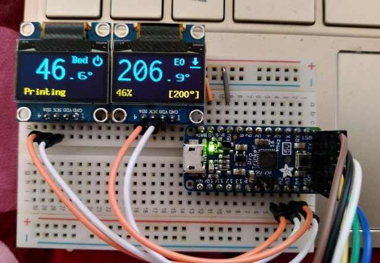

## Little Eyes For a printer..
# Temperature display for RepRap firmware (eg Duet)

* Only displays very basic info: Status, tool and bed activity + temperature, pct printed (when printing)
 * This is it.. the displays are less then an 2cm in size and I will not overload them with info
* brightness and power control
* Uses the auxillary UART port on 32bit controllers (eg Duet)
* Sends M408 requests for basic data and then proceses the Json reply
* Also responds to some 'config' Json
