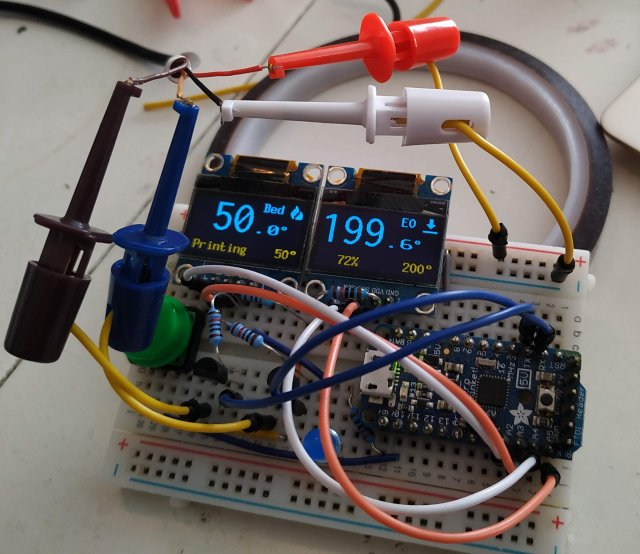
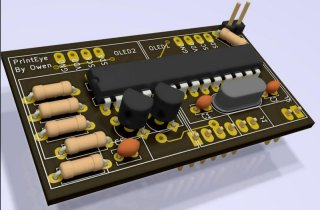

## Little Eyes For a printer..
# Temperature display for RepRap firmware (eg Duet)

* Only displays very basic info: Status, tool and bed activity + temperature, pct printed (when printing)
 * This is it.. the displays are less then an 2cm in size and I will not overload them with info
* Sends `M408 S0` requests for basic data and then proceses the Json reply
 * Uses the auxillary UART port on 32bit controllers (eg Duet)
 * Uses Jsmn (jasmin) to process lots of Json in a smallish footprint
* Also responds to some 'config' Json:
 * timeout, update speed, brightness, and more
* Sleep mode when controller reports status 'O' (PSU off, configurable)
* Activity LED that blinks on incoming data (brightness configurable)
* Pause button with 200ms hold-down/fatfinger delay. (configurable, disableable)
* Correctly reports heater settings, shows if selected heater is in a fault state.
* Sends commands with checksum; defaults to 57600 baud and is plug-n-play with panelDue UART port

## Rquirements 
* None really; you need to be able to compile and upload to your target, and be a bit competent at assembling stuff, but all the libraries needed are included.
 * The Jsmn library (https://github.com/zserge/jsmn) is included with the sketch
 * The Arduino MemoryFree lib is used during debug (see comments and `#define DEBUG` in code)

## Build
 
* Only exists as a prototype at present; It has, however been proved on my printer; image at top is an "action Shot" :-)
* Hardware and PCB design is complete: [PrintEyeHardware](https://easytarget.org/ogit/circuits/PrintEyeHardware)
 * A PCB design exists; needs to be prototyped on a breadboard first; then built.

## Control
The Jsmn library is used, which provides some robustness in processing key/value pairs (use of quotes etc; the Json must still be structually correct and terminated)
* `{"printeye_interval":integer}`
 * Set the approximate interval in Ms that PrintEye spends waiting for a `M408` response before retrying
* `{"printeye_maxfail":integer}`
 * Maximum number of failures before displaying `Waiting for Printer`
 * `-1` to prevent entering `Waiting for Printer` state
* `{"printeye_brightness":byte}`
 * Brightness for display, 0-255, 0 is off
* `{"printeye_powersave":boolean}`
 * If true enter sleep mode when printer status = 'O' (Vin off)
* `{"printeye_pausecontrol":integer}`
 * Number of Ms the button must be held to trigger a pause (`M25`) while printing, and resume (`M24`) when paused
 * Set to zero to disable the pause button
 * Setting this longer than the updateinterval might produce activity LED weirdness and laggy response
* `{"printeye_activityled":byte}`
 * Brightness level (0-255) for the activity LED, set to 0 to disable
* `{"printeye_lmsg":"string"}` & `{"printeye_rmsg":"string"}`
 * Left and right panel text to be displayed in Idle and Sleep mode, max 10 characters, enclose in quotes.
 * Setting the left text to `SHOWSTATUS` results in the default behaviour of showing the actual status there

## Caveats:
* Memory is key here; the Json parser uses quite a bit of ram, and code space. The Displays and their library eat the rest. I've had to fight low program memory and ram to get this working acceptably.
* Max json size = 500 bytes; or 86 [Jsmn tokens](https://github.com/zserge/jsmn#design).
 * The current code cannot survive a sudden increase in size of M408 S0 responses (eg from a firmware update)
 * Exceeding this causes the incoming Json to be ignored 
 * These defaults are the result of considerable testing and debugging; they should be good for responses from a 4 extruder system with heated bed and enclosure
 * When the OLED's corrupt and show artifacts.. you have increased these too far!
* Software I2C is slow. 
 * Experimenting with an alternative (one HW + One SW) looked weird and unbalanced.
 * An I2C multiplexer would solve this, or using a chip (Mega256?) with dual hardware I2C, both add complexity
 * I have tried to compensate for the slow redrawing by sequencing the order of updating screen elements; eg making the updates look more like animations.
* You will need level shifters for interfacing to a Duet UART (PanelDue) port if you run this at 16Mhz/5v, alternatively use a 12Mhz/3.3v combo, or experiment with 16Mhz/3.3v and the underclock option discussed in the `setup()` section of the sketch. Display updates will be even slower for this, and you will need to add a 3v3 regulator, or tap the controllers 3v3 line for power.

## Enhancements: 
* Hurrah; I (nearly) emptied this list; the idea is to keep this simple, so I dont intend to add things here!
* Oh; Ok Then. WiFi Status. But some other functionality would need to go to squeeze it in since it's not part of the M408 response(s).

### For Later/Never
* Displaying an Enclosure temp on a cycle with bed temp.
* EEPROM for settings
* Investigate wether it is possible to multiplex the HW I2C bus (SCK) with IO pins and a couple of signal diodes to address one display or the other, or both for setup, clearing etc.
